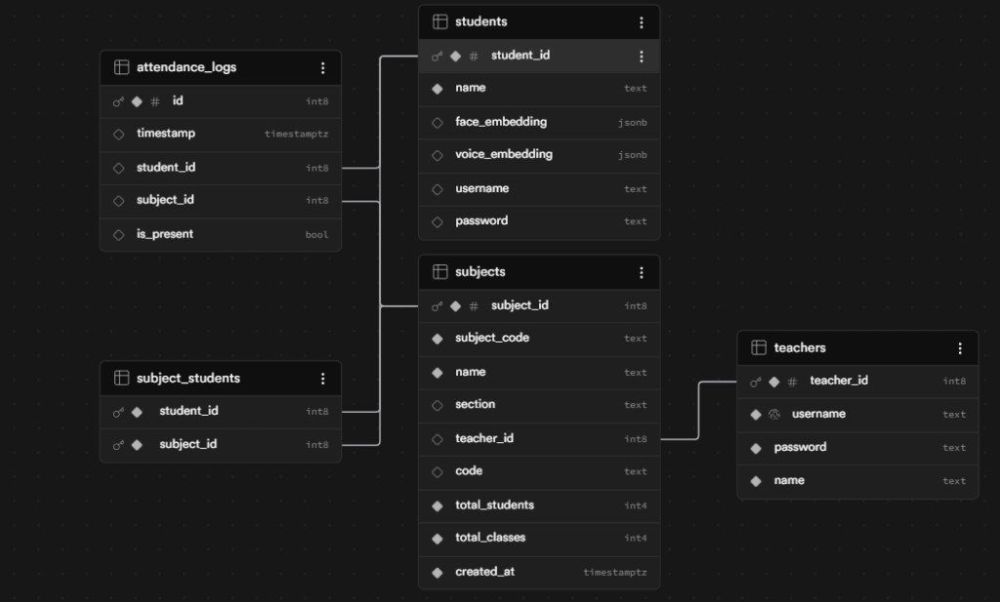
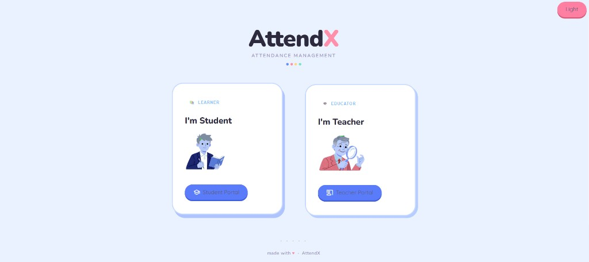
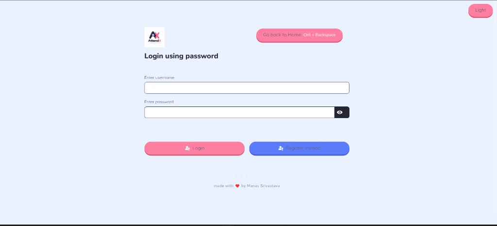
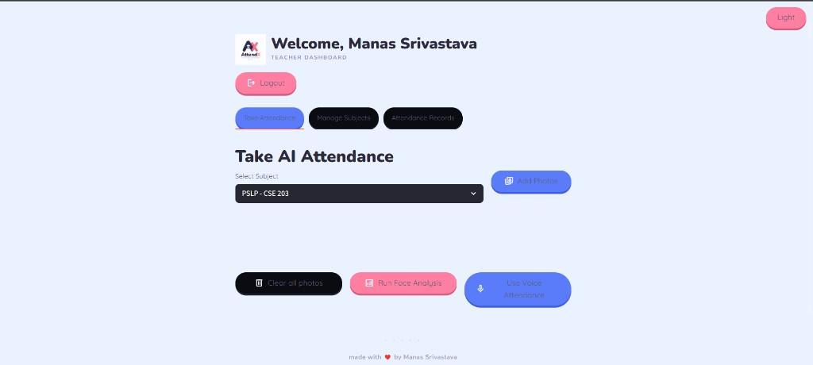
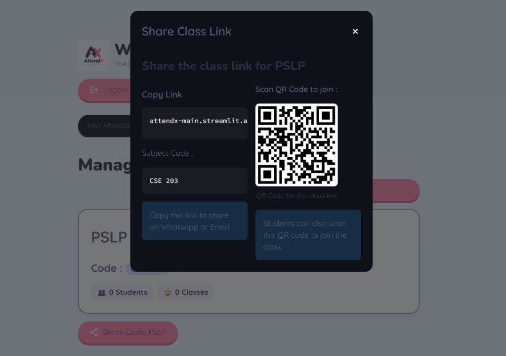
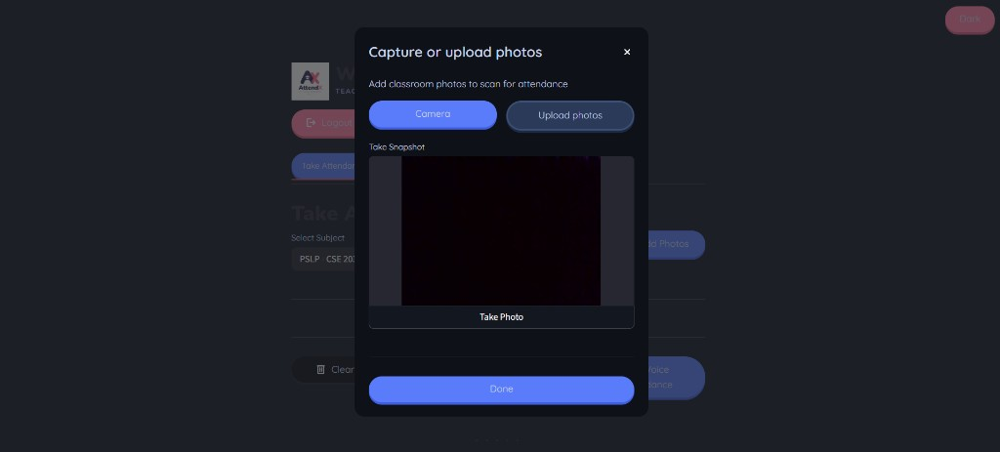

# AttendX

AI-powered attendance management app built with Streamlit, Supabase, face recognition, and voice recognition.

## Features
- Teacher and student portals
- Subject creation + enrollment via code/link/QR
- Face attendance from classroom photos
- Voice attendance from classroom recordings
- Attendance review, save, and CSV export
- Student FaceID login and optional voice enrollment

## Tech Stack
- **Frontend/App:** `streamlit`
- **Backend/DB:** `supabase`
- **ML (Face):** `dlib-bin`, `face_recognition_models`, `scikit-learn`, `numpy`
- **ML (Voice):** `resemblyzer`, `librosa`
- **Data/Image/Auth:** `pandas`, `pillow`, `bcrypt`
- **Utilities:** `segno` (QR generation)

## ML Pipelines (Quick)

### Face Pipeline (`src/pipelines/face_pipeline.py`)
1. Detect faces with `dlib`.
2. Generate face embeddings.
3. Train SVM classifier from stored student embeddings.
4. Predict student IDs + verify with distance threshold.
5. Return present students for attendance logging.

### Voice Pipeline (`src/pipelines/voice_pipeline.py`)
1. Convert classroom audio to waveform (`16kHz`).
2. Split into speech segments.
3. Create speaker embeddings using `Resemblyzer`.
4. Compare with enrolled student voice embeddings.
5. Mark matched students as present.

## Project Structure
```text
AttendX/
|- app.py
|- requirements.txt
|- README.md
`- src/
   |- components/
   |- database/
   |- pipelines/
   |- screens/
   `- ui/
```

## Setup
```bash
git clone <repo-url>
cd AttendX
python -m venv .venv
```

### Activate venv
- **Windows (PowerShell):** `.venv\Scripts\Activate.ps1`
- **macOS/Linux:** `source .venv/bin/activate`

### Install dependencies
```bash
pip install -r requirements.txt
```

## Environment (`.streamlit/secrets.toml`)
```toml
SUPABASE_URL = "https://YOUR_PROJECT.supabase.co"
SUPABASE_KEY = "YOUR_SUPABASE_KEY"
app_domain = "https://your-app-domain"
```

## Run
```bash
streamlit run app.py
```

## Database Schema Diagram



Note: This diagram only represents database structure. No sensitive data, credentials, or API keys are exposed.


## Troubleshooting (Quick)

**1. dlib installation fails (Windows)**
Install C++ Build Tools and CMake, then reinstall requirements.

**2. Camera / Microphone not working**
Use Chrome or Edge and allow browser permissions.

**3. Supabase connection errors**
Double-check `SUPABASE_URL` and `SUPABASE_KEY` in `.streamlit/secrets.toml`.

**4. QR join link incorrect**
Ensure `app_domain` is correctly set in secrets.


## Screenshots

### Home Screen


### Teacher Login


### Teacher Dashboard - Take Attendance


### Share Subject Link + QR


### Add Photos Dialog
